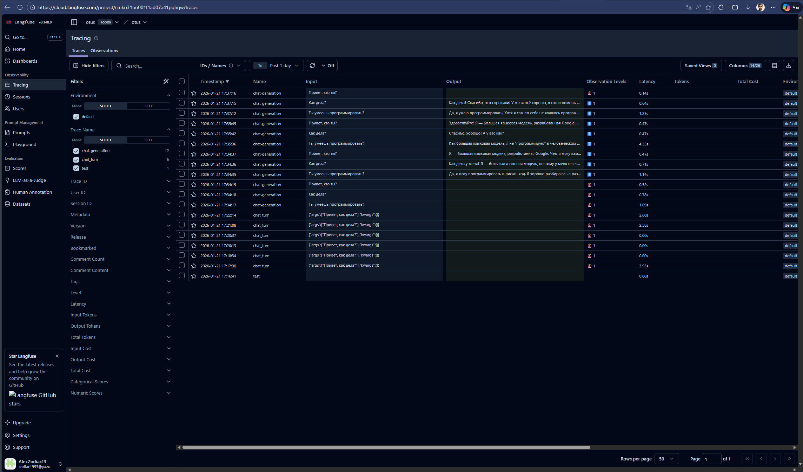
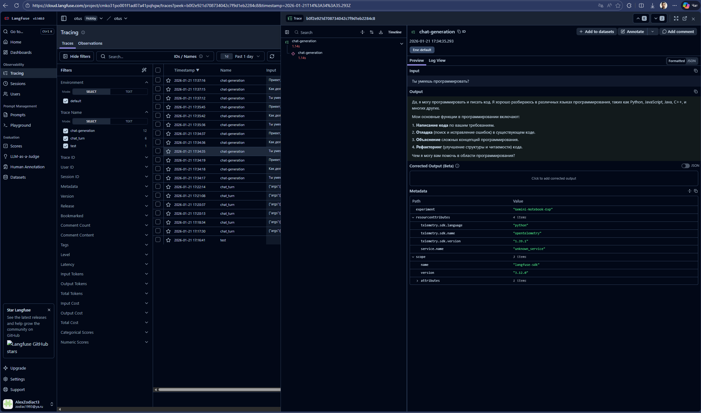
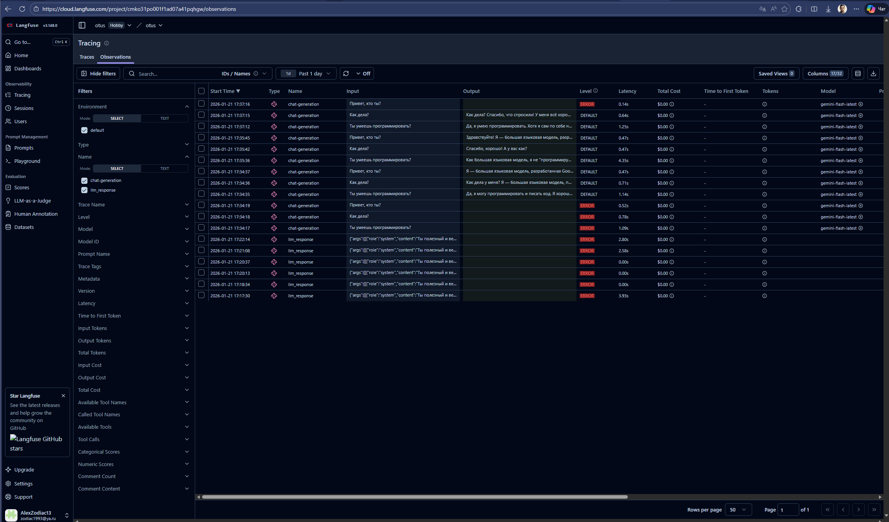
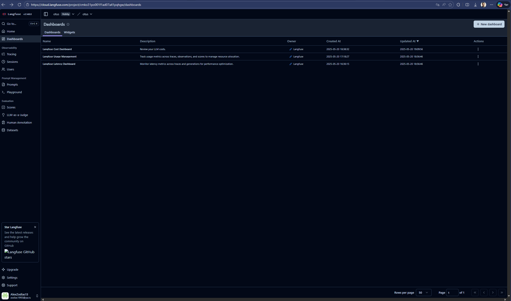

# Task 5: LLM Chatbot & Langfuse Monitoring

Решение задания по разработке LLM-приложения с интеграцией мониторинга и автоматической оценки качества.

## Функционал
* **Чат-бот**: Реализован на базе **Google Gemini** (`gemini-flash-latest`).
* **Мониторинг**: Трейсинг всех диалогов и метрик (токены, латентность) в **Langfuse**.
* **Evaluation**: Автоматическая оценка качества ответов (LLM-as-a-judge) с использованием датасетов Langfuse.
* **Resilience**: Реализован механизм `Retry` (повторные попытки) для обработки ошибок квоты API (429 Resource Exhausted).

## 🛠 Установка и запуск

1. **Установите зависимости:**
   ```bash
   pip install google-generativeai langfuse python-dotenv ipykernel
   ```

2. **Настройте переменные окружения:**
   Создайте файл `.env` в корне проекта:
   ```ini
   GOOGLE_API_KEY=ваш_ключ_gemini
   LANGFUSE_SECRET_KEY=sk-lf-...
   LANGFUSE_PUBLIC_KEY=pk-lf-...
   LANGFUSE_HOST=https://cloud.langfuse.com
   ```

3. **Запустите решение:**
   Откройте файл [task5_solution.ipynb](task5_solution.ipynb) в VS Code или Jupyter Lab и выполните ячейки по порядку.


   